<h2>TensorFlow-FlexUNet-Image-Segmentation-KSSD2025-Kidney-Stone-CT (2026/02/10)</h2>
Sarah T.  Arai 
Software Laboratory antillia.com  
This is the first experiment of Image Segmentation for <b>Kidney-Stone-CT</b> based on our <a href="./src/TensorFlowFlexUNet.py">TensorFlowFlexUNet</a> 
(TensorFlow Flexible UNet Image Segmentation Model for Multiclass), 
and 
<a href="https://www.kaggle.com/datasets/murillobouzon/kssd2025-kidney-stone-segmentation-dataset">
<b>KSSD2025 - Kidney Stone Segmentation Dataset</b> </a> on the kaggle.com.
  
<b>Data Augmentation Strategy</b> 
To address the limited size of images and masks of the original <b>KSSD2025</b> dataset, which contains 838 annotated images, 
we used our offline augmentation tool <a href="./generator/ImageMaskDatasetGenerator.py">ImageMaskDatasetGenerator.py</a> (please see also: 
<a href="https://github.com/sarah-antillia/Image-Deformation-Tool">Image-Deformation-Tool</a>)
 to generate a PNG <a href="https://drive.google.com/file/d/13F-R3-x2s9Gte2qrj_Wc556mAwJbojUS/view?usp=sharing">
  Augmented-KSSD2025-Kidney-Stone-CT-ImageMask-Dataset
 </a>.
   

<b>Actual Image Segmentation for Kidney-Stone-CT Images of 512x512 pixels </b> 
As shown below, the inferred masks predicted by our segmentation model trained by the dataset appear similar to the ground truth masks.
 
  
<table>
<tr>
<th>Input: image</th>
<th>Mask (ground_truth)</th>
<th>Prediction: inferred_mask</th>
</tr>
<tr>
<td>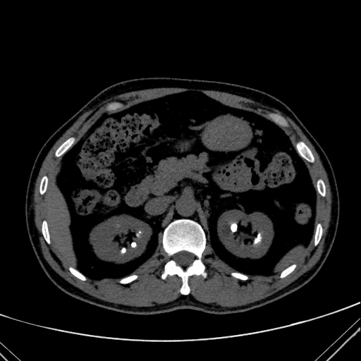</td>
<td></td>
<td>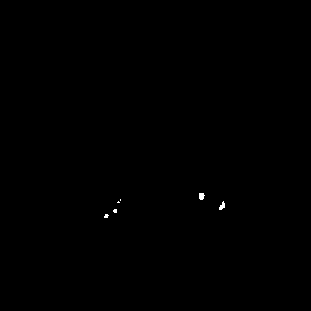</td>
</tr>

<tr>
<td>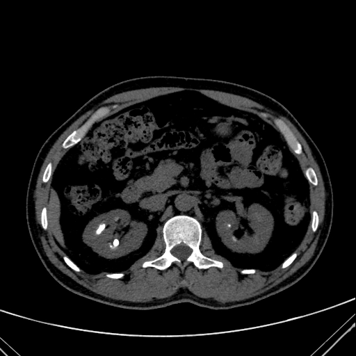</td>
<td></td>
<td></td>
</tr>

<tr>
<td>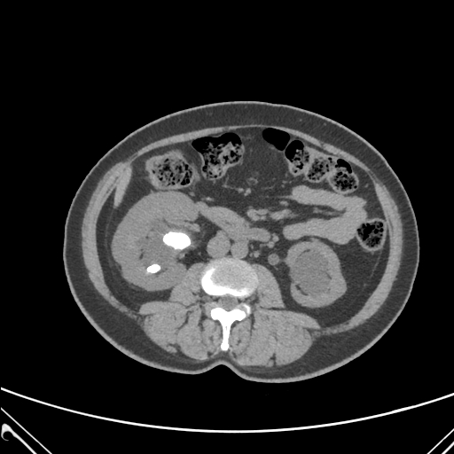</td>
<td></td>
<td>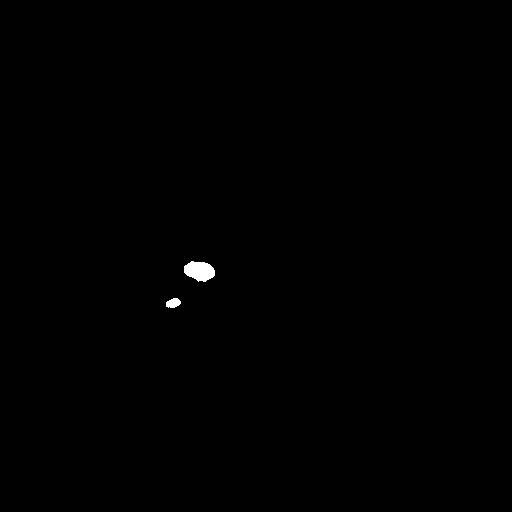</td>
</tr>
</table>

 
<h3>1  Dataset Citation</h3>
The dataset used here was derived from   
<a href="https://www.kaggle.com/datasets/murillobouzon/kssd2025-kidney-stone-segmentation-dataset">
<b>KSSD2025 - Kidney Stone Segmentation Dataset</b> </a>
 <b>Dataset for automatic kidney stone segmentation in axial CT scans</b>
  
For more information, please refer to <a href="https://ieeexplore.ieee.org/document/11165055">
KSSD2025: A New Annotated Dataset for Automatic Kidney Stone Segmentation and Evaluation With Modified U-Net Based Deep Learning Models</a>
  
The following explanation was taken from 
<a href="https://www.kaggle.com/datasets/murillobouzon/kssd2025-kidney-stone-segmentation-dataset">KSSD2025</a> on the kaggle.com.
  
<b>About Dataset</b> 
<b> Overview</b> 
KSSD2025 is a dataset of axial CT images with expert-annotated kidney stone segmentation masks, created to support deep learning research in medical image segmentation. It is derived from the public dataset by Islam et al. (2022), which contains CT images with different kidney conditions. 
KSSD2025 focuses exclusively on kidney stone cases, offering precise ground-truth masks for developing and benchmarking AI-based segmentation models.
  
<b>Description</b> 
This dataset presents a carefully refined subset of the original "CT Kidney Dataset: Normal-Cyst-Tumor and Stone" by Islam et al., comprising only 
axial CT images that exhibit kidney stones. Out of 12,446 images in the original collection, 
838 images were selected for manual annotation based on the presence of stones and the axial orientation, which 
offers better anatomical context for segmentation tasks.
  
<b>Dataset Details</b> 
Total Annotated Images: 838 
View: Axial 
Annotations: Binary segmentation masks (kidney stone regions) 
Image Format: TIF 
Size: 305.38 MB 
Source Dataset: <a href="https://www.kaggle.com/datasets/nazmul0087/ct-kidney-dataset-normal-cyst-tumor-and-stone">
CT KIDNEY DATASET: Normal-Cyst-Tumor and Stone</a> 
Annotation Method: Semi-automatic (thresholding + connected components) followed by expert manual refinement
  

<b>Citations</b> 
Islam MN, Hasan M, Hossain M, Alam M, Rabiul G, Uddin MZ, Soylu A. Vision transformer and explainable transfer learning models 
for auto detection of kidney cyst, stone and tumor from CT-radiography. Scientific Reports. 2022. 
M. F. Bouzon et al., "KSSD2025: A New Annotated Dataset for Automatic Kidney Stone Segmentation and Evaluation 
with Modified U-Net Based Deep Learning Models," in IEEE Access, doi: 10.1109/ACCESS.2025.3610027
  
<b>License</b> 
Datafiles © Nazmul Islam  
<b>Institutions Involved</b> 
Centro Universitário FEI 
Hospital Universitário da Universidade de São Paulo 
Based on original dataset by: 
Islam MN, Hasan M, Hossain M, Alam M, Rabiul G, Uddin MZ, Soylu A.  
Vision transformer and explainable transfer learning models for auto detection of kidney cyst, stone and tumor 
from CT-radiography. Scientific Reports. 2022.
<!--
Please see also: <a href="https://ieeexplore.ieee.org/document/11165055">KSSD2025: A New Annotated Dataset for Automatic Kidney Stone Segmentation and Evaluation With Modified U-Net Based Deep Learning Models
</a>
-->
 
 
<h3>
2 Kidney-Stone-CT ImageMask Dataset
</h3>
 If you would like to train this Kidney-Stone-CT Segmentation model by yourself,
please down load  the <a href="https://drive.google.com/file/d/13F-R3-x2s9Gte2qrj_Wc556mAwJbojUS/view?usp=sharing">
  Augmented-KSSD2025-Kidney-Stone-CT-ImageMask-Dataset.zip
 </a> on the google driive.
</b> 
We used our offline augmentation tool <a href="./generator/ImageMaskDataset.py">ImageMaskDataset.py</a> to generate 
the  Augmented Kidney-Stone-CT dataset. 
<pre>
./dataset
└─Kidney-Stone-CT
    ├─test
    │   ├─images
    │   └─masks
    ├─train
    │   ├─images
    │   └─masks
    └─valid
        ├─images
        └─masks
</pre>
 
<b>Kidney-Stone-CT Statistics</b> 
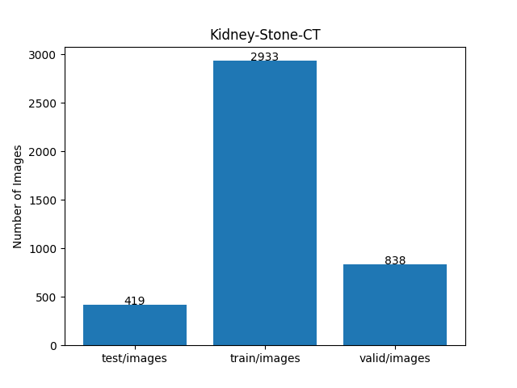 
 
As shown above, the number of images of train and valid datasets is large enough to use for a training set of our segmentation model.
  

<b>Train_images_sample</b> 
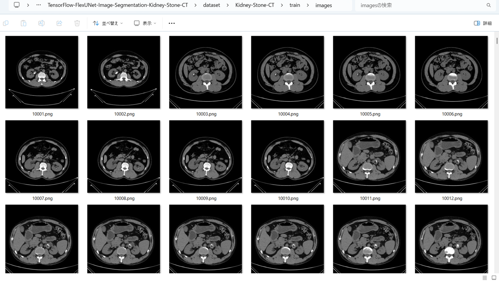
 
<b>Train_masks_sample</b> 
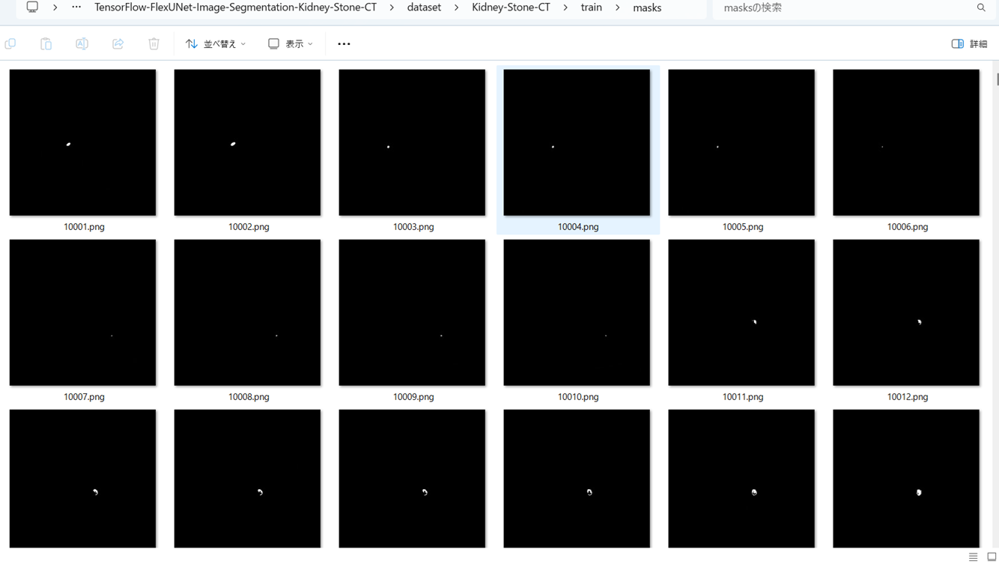
 
<h3>
3 Train TensorflowFlexUNet Model
</h3>
 We trained Kidney-Stone-CT TensorflowFlexUNet Model by using the following
<a href="./projects/TensorFlowFlexUNet/Kidney-Stone-CT/train_eval_infer.config"> <b>train_eval_infer.config</b></a> file.  
Please move to ./projects/TensorFlowFlexUNet/Kidney-Stone-CT and run the following bat file. 
<pre>
>1.train.bat
</pre>
, which simply runs the following command. 
<pre>
>python ../../../src/TensorFlowFlexUNetTrainer.py ./train_eval_infer.config
</pre>

<b>Model parameters</b> 
Defined a small <b>base_filters=16</b> and a large <b>base_kernels=(11,11)</b> for the first Conv Layer of Encoder Block of 
<a href="./src/TensorFlowFlexUNet.py">TensorFlowFlexUNet.py</a> 
and a large num_layers (including a bridge between Encoder and Decoder Blocks).
<pre>
[model]
image_width    = 512
image_height   = 512
image_channels = 3
input_normalize = True
normalization  = False
num_classes    = 2
base_filters   = 16
base_kernels  = (11,11)
num_layers    = 8
dropout_rate   = 0.05
dilation       = (1,1)
</pre>

<b>Learning rate</b> 
Defined a small learning rate.  
<pre>
[model]
learning_rate  = 0.00007
</pre>

<b>Loss and metrics functions</b> 
Specified "categorical_crossentropy" and "dice_coef_multiclass". 
<pre>
[model]
loss           = "categorical_crossentropy"
metrics        = ["dice_coef_multiclass"]
</pre>
<b >Learning rate reducer callback</b> 
Enabled learing_rate_reducer callback, and a small reducer_patience.
<pre> 
[train]
learning_rate_reducer = True
reducer_factor     = 0.5
reducer_patience   = 4
</pre>
<b>Early stopping callback</b> 
Enabled early stopping callback with patience parameter.
<pre>
[train]
patience      = 10
</pre>
<b></b> 
<b>RGB color map</b> 
rgb color map dict for Kidney-Stone-CT 1+1 classes. 
<pre>
[mask]
mask_file_format = ".png"
;Kidney-Stone-CT 1+1
rgb_map = {(0,0,0):0, (255,255,255):1,  }       
</pre>
<b>Epoch change inference callbacks</b> 
Enabled epoch_change_infer callback. 
<pre>
[train]
epoch_change_infer       = True
epoch_change_infer_dir   =  "./epoch_change_infer"
epoch_changeinfer        = False
epoch_changeinfer_dir    = "./epoch_changeinfer"
num_infer_images         = 6
</pre>
By using this epoch_change_infer callback, on every epoch_change, the inference procedure can be called
 for 6 images in <b>mini_test</b> folder. This will help you confirm how the predicted mask changes 
 at each epoch during your training process.    
<b>Epoch_change_inference output at starting (1,2,3)</b> 
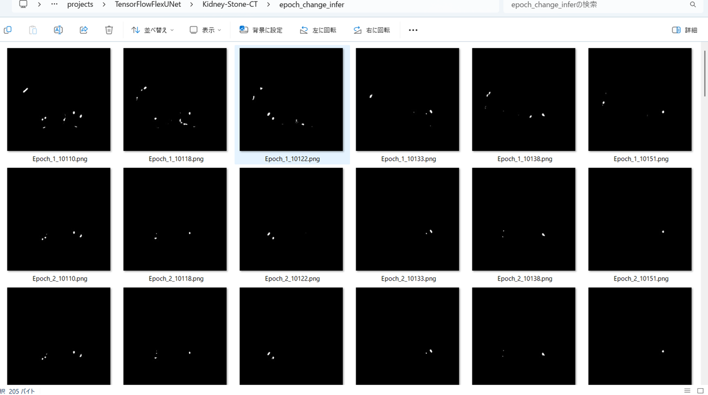 
 
<b>Epoch_change_inference output at middle-point (13,14,15)</b> 
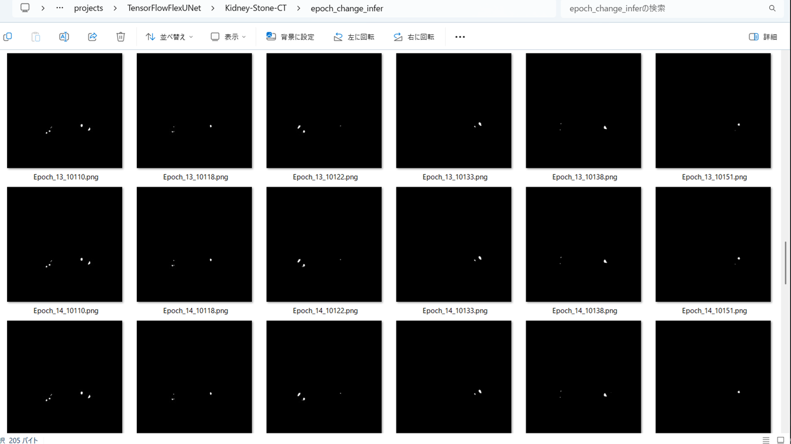 
 
<b>Epoch_change_inference output at ending (28,29,30)</b> 
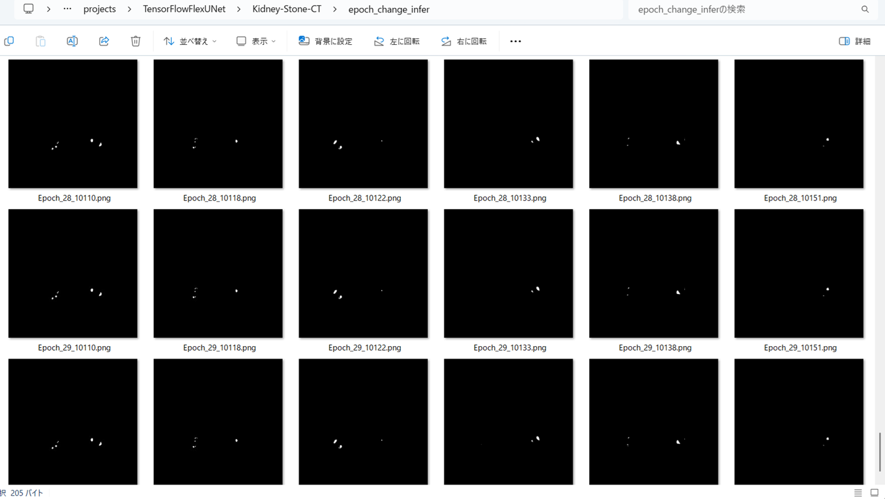 

 
In this experiment, the training process was terminated at epoch 30.  
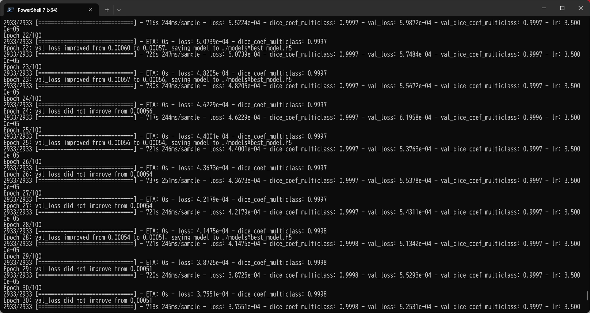 
 
<a href="./projects/TensorFlowFlexUNet/Kidney-Stone-CT/eval/train_metrics.csv">train_metrics.csv</a> 
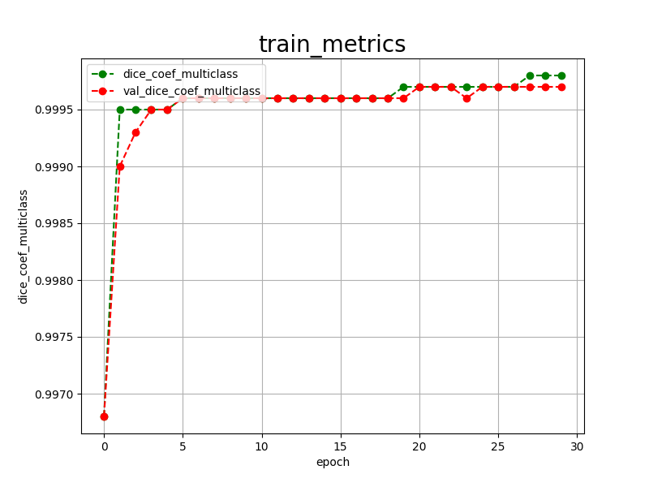 

 
<a href="./projects/TensorFlowFlexUNet/Kidney-Stone-CT/eval/train_losses.csv">train_losses.csv</a> 
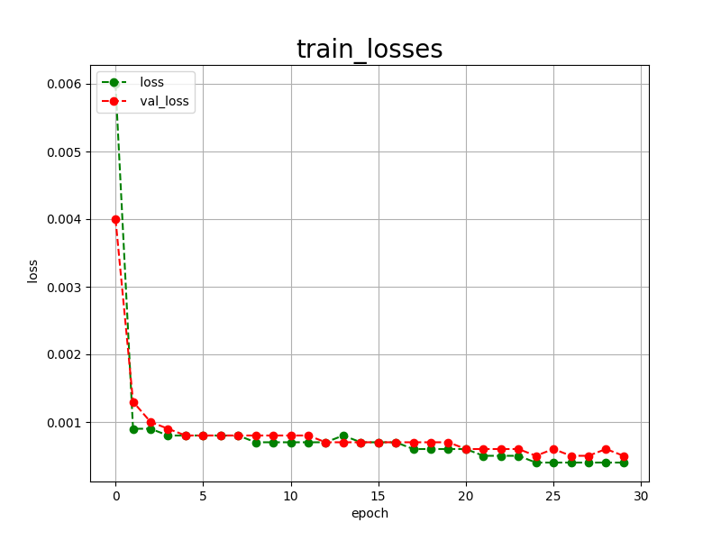 
 
<h3>
4 Evaluation
</h3>
Please move to a <b>./projects/TensorFlowFlexUNet/Kidney-Stone-CT</b> folder, 
and run the following bat file to evaluate TensorflowFlexUNet model for Kidney-Stone-CT. 
<pre>
>./2.evaluate.bat
</pre>
This bat file simply runs the following command.
<pre>
>python ../../../src/TensorFlowFlexUNetEvaluator.py  ./train_eval_infer.config
</pre>
Evaluation console output: 
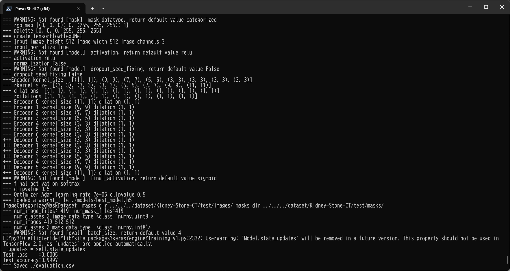
  Image-Segmentation-Kidney-Stone-CT

<a href="./projects/TensorFlowFlexUNet/Kidney-Stone-CT/evaluation.csv">evaluation.csv</a> 
The loss (categorical_crossentropy) to this Kidney-Stone-CT/test was very low, and dice_coef_multiclass very high as shown below.
 
<pre>
categorical_crossentropy,0.0005
dice_coef_multiclass,0.9997
</pre>
 
<h3>5 Inference</h3>
Please move to a <b>./projects/TensorFlowFlexUNet/Kidney-Stone-CT</b> folder 
,and run the following bat file to infer segmentation regions for images by the Trained-TensorflowFlexUNet model for Kidney-Stone-CT. 
<pre>
>./3.infer.bat
</pre>
This simply runs the following command.
<pre>
>python ../../../src/TensorFlowFlexUNetInferencer.py ./train_eval_infer.config
</pre>

<b>mini_test_images</b> 
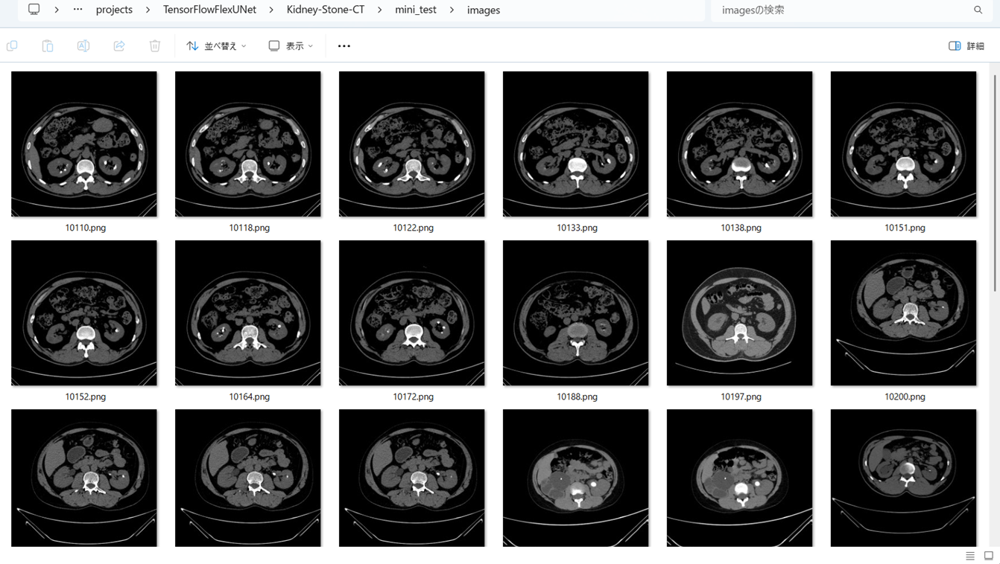 
<b>mini_test_mask(ground_truth)</b> 
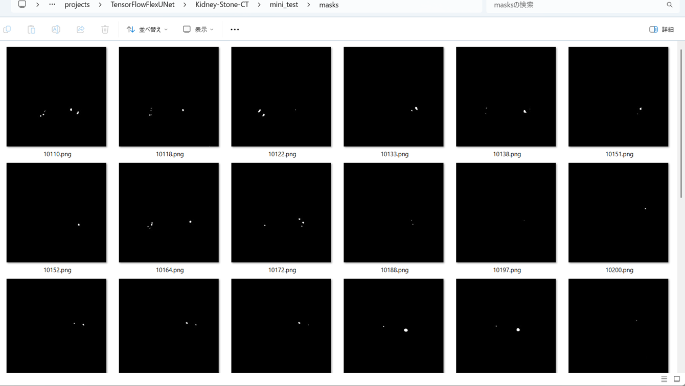 

<b>Inferred test masks</b> 
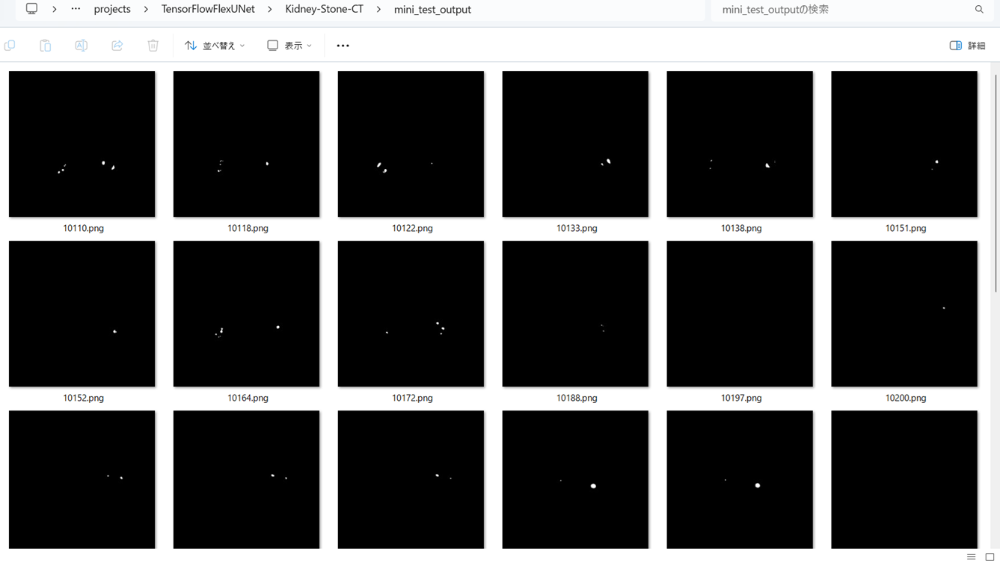 
 

<b>Enlarged images and masks for  Kidney-Stone-CT  Images of 512x512 pixels</b> 
As shown below, the inferred masks predicted by our segmentation model trained by the dataset appear similar to the ground truth masks.
 
 
<table>
<tr>
<th>Input: image</th>
<th>Mask (ground_truth)</th>
<th>Prediction: inferred_mask</th>
</tr>
<tr>
<td>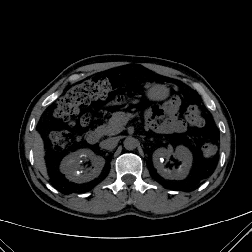</td>
<td></td>
<td>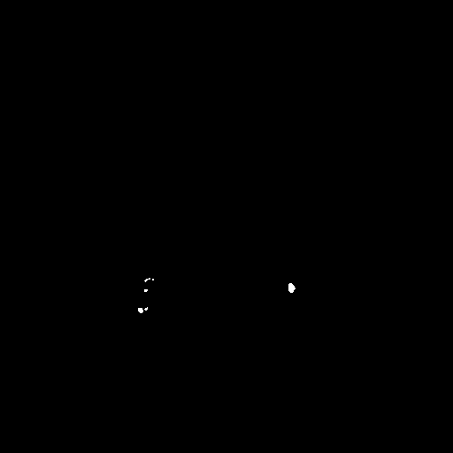</td>
</tr>

<tr>
<td>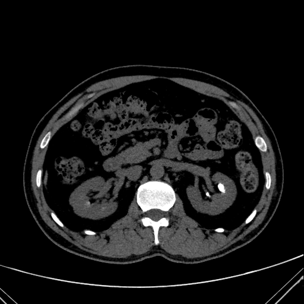</td>
<td></td>
<td>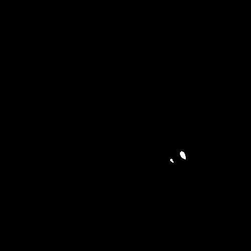</td>
</tr>

<tr>
<td>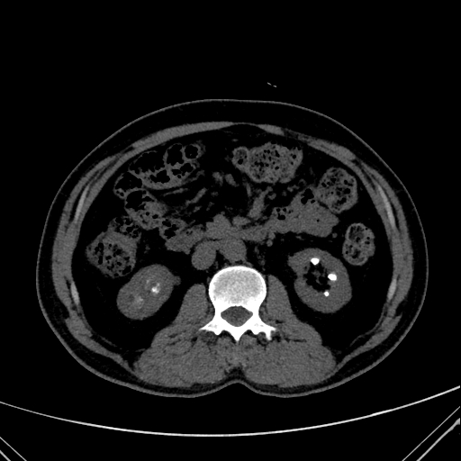</td>
<td></td>
<td>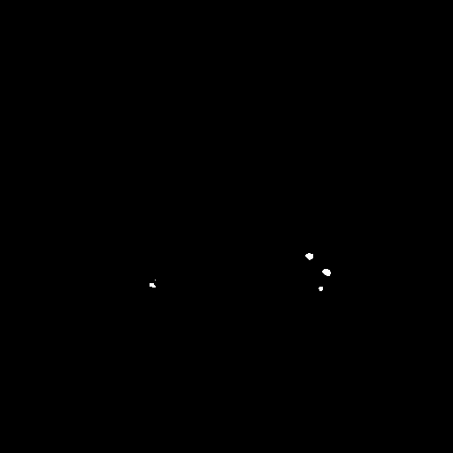</td>
</tr>
<tr>
<td></td>
<td></td>
<td></td>
</tr>
<tr>
<td>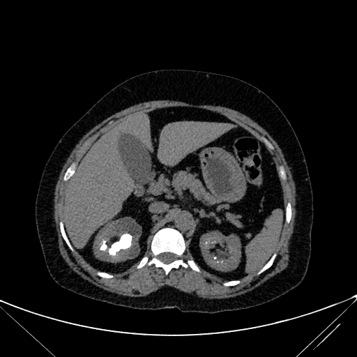</td>
<td>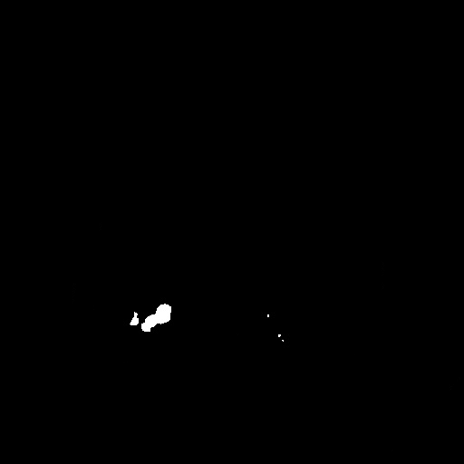</td>
<td></td>
</tr>
<tr>
<td>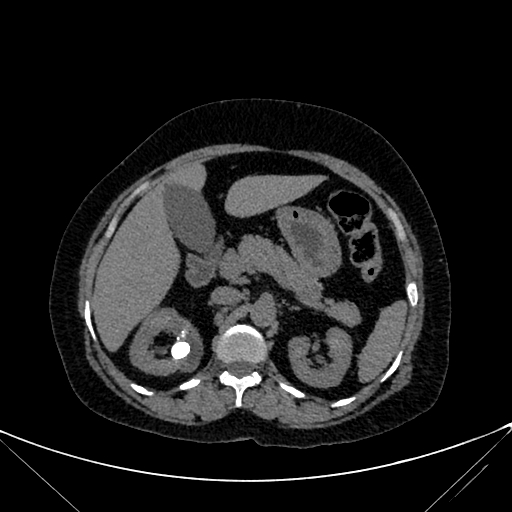</td>
<td></td>
<td>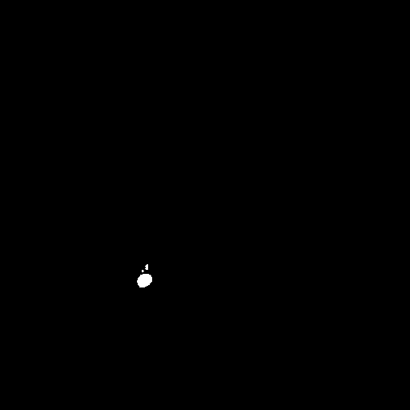</td>
</tr>
</table>

 
<h3>
References
</h3>
<b>1. KSSD2025: A New Annotated Dataset for Automatic Kidney Stone Segmentation and Evaluation With Modified U-Net Based Deep Learning Models</b> 
Murillo F. Murillobouzon; Paulo H. S. de Santana; Gabriel N. Missima; Weverson S. Pereira; Fernando P. Rivera; Gilson A. Giraldi 
<a href="https://ieeexplore.ieee.org/document/11165055">https://ieeexplore.ieee.org/document/11165055</a>
  
<b>2. A deep learning system for automated kidney stone detection and volumetric segmentation on noncontrast CT scans</b> 
Daniel C. Elton, Evrim B.Turkbey, Perry J.Pickhardt, Ronald M.Summers 
<a href="https://www.moreisdifferent.com/assets/my_papers/B_AI_medical_imaging/2022_Z_Elton_Medical_Physics_kidney_stone_detector.pdf">
https://www.moreisdifferent.com/assets/my_papers/B_AI_medical_imaging/2022_Z_Elton_Medical_Physics_kidney_stone_detector.pdf</a>
  
<b>3. TensorFlow-FlexUNet-Image-Segmentation-Model</b> 
Toshiyuki Arai  
<a href="https://github.com/sarah-antillia/TensorFlow-FlexUNet-Image-Segmentation-Model">
https://github.com/sarah-antillia/TensorFlow-FlexUNet-Image-Segmentation-Model
</a>
 
 
